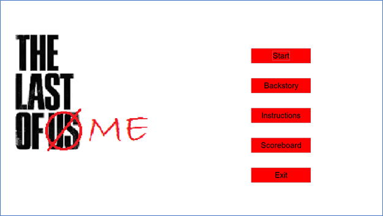
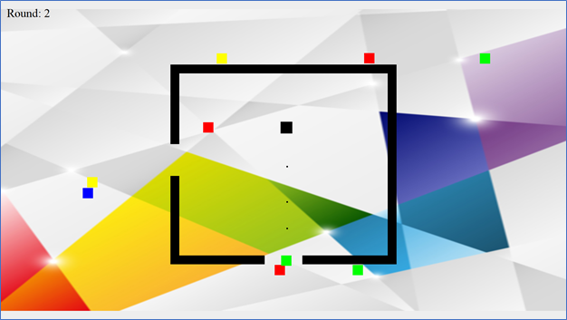

# The Last of Me

This is a singleplayer game that involves many moving parts in order to work. Uses a Java Object-Oriented Design
to implement many features in the game including a user friendly GUI.

  

## Gameplay

The player uses "W, A, S, D" keys to move and "Space" to shoot. The direction the player shoots is based on the movement of the entity. Players face rounds of bots that come in different colours. Each one differs in health (amount of bullets it can withstand) and speed. This game implements an algorithm that guides the enemy entities to the player through the fastest route possible around the structures that might block its path.

  

